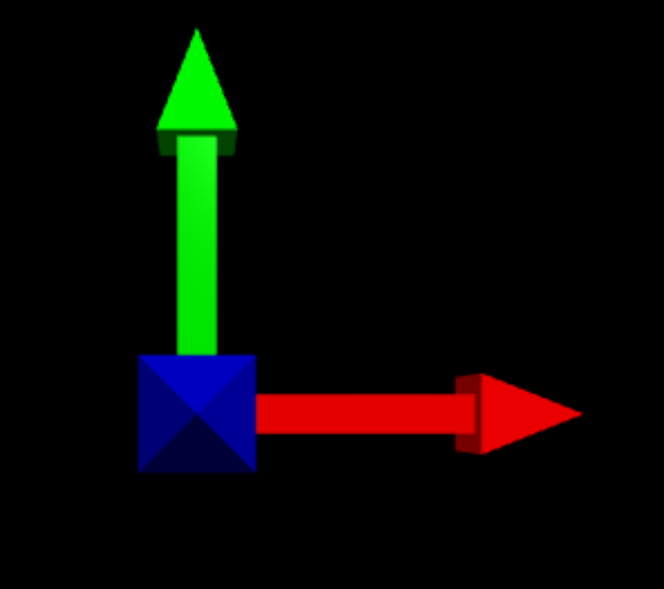
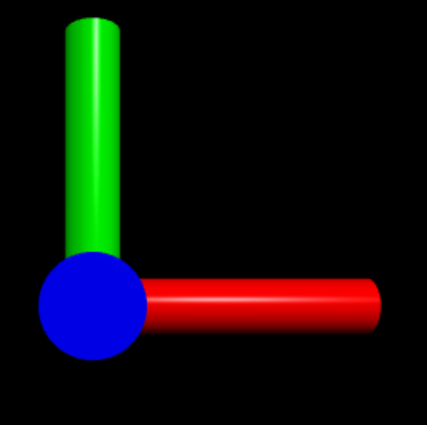
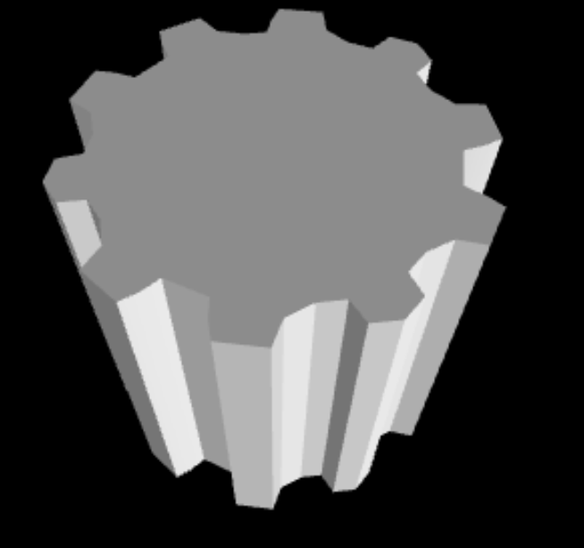

# VPython Examples

Author: [Alan Badillo Salas](mailto:alan@nomadacode.com)

<style>
img.screenshot {
    height:100px !important;
    width:100% !important;
    object-fit:contain !important;
    background-color:black !important;
    padding:40px 0px !important;
}
</style>

## Example 101 - Spheres

Display 3 spheres of different colors on each axis


> [101_spheres.py](./101_spheres.py)

```py
from vpython import *

ball1 = sphere(pos=vector(1, 0, 0), radius=0.1, color=color.red)

print(ball1.pos)

ball2 = sphere(pos=vector(0, 1, 0), radius=0.1, color=color.green)

print(ball2.pos)

ball3 = sphere(pos=vector(0, 0, 1), radius=0.1, color=color.blue)

print(ball3.pos)
```

## Example 102 - Axis

Display 3 arrows on each axis



> [102_axis.py](./102_axis.py)

```py
from vpython import *

axis_x = arrow(pos=vector(0, 0, 0), axis=vector(1, 0, 0), color=color.red)
axis_y = arrow(pos=vector(0, 0, 0), axis=vector(0, 1, 0), color=color.green)
axis_z = arrow(pos=vector(0, 0, 0), axis=vector(0, 0, 1), color=color.blue)
```

## Example 103 - Boxes

Display 3 boxes on different places


> [103_boxes.py](./103_boxes.py)

```py
from vpython import *

box(pos=vector(0, 0, 0), length=2, height=0.5, width=1)

box(pos=vector(1, 1, 1), up=vector(1, 0, 0), size=vector(2, 0.5, 1), color=color.red)
box(pos=vector(1, 1, 1), up=vector(0, 1, 0), size=vector(2, 0.5, 0.9), color=color.green)
box(pos=vector(1, 1, 1), up=vector(0, 0, 1), size=vector(1.9, 0.5, 1), color=color.blue)
```

## Example 104 - Cylinders

Display 3 cylinders of different colors on each axis



> [104_cylinder.py](./104_cylinder.py)

```py
from vpython import *

c1 = cylinder(pos=vector(0, 0, 0), axis=vector(1, 0, 0), length=1, radius=0.1, color=color.red)
c2 = cylinder(pos=vector(0, 0, 0), axis=vector(0, 1, 0), length=1, radius=0.1, color=color.green)
c3 = cylinder(pos=vector(0, 0, 0), axis=vector(0, 0, 1), length=1, radius=0.1, color=color.blue)
```

## Example 105 - Cylinder Cube

Display a cube made of cylinders


> [105_cylinder_cube.py](./105_cylinder_cube.py)

```py
from vpython import *

center = vector(1, 1, 1)

p1 = center + vector(0, 0, 0)
p2 = center + vector(1, 0, 0)
p3 = center + vector(0, 1, 0)
p4 = center + vector(0, 0, 1)
p5 = center + vector(1, 1, 0)
p6 = center + vector(1, 0, 1)
p7 = center + vector(0, 1, 1)
p8 = center + vector(1, 1, 1)

sphere(pos=p1, radius=0.1, color=color.orange)
sphere(pos=p2, radius=0.1, color=color.red)
sphere(pos=p3, radius=0.1, color=color.green)
sphere(pos=p4, radius=0.1, color=color.blue)
sphere(pos=p5, radius=0.1, color=color.yellow)
sphere(pos=p6, radius=0.1, color=color.magenta)
sphere(pos=p7, radius=0.1, color=color.cyan)
sphere(pos=p8, radius=0.1, color=color.purple)

def cylinder_from_to(pos1, pos2):
    d = mag(pos2 - pos1)
    cylinder(pos=pos1, axis=pos2 - pos1, length=d, radius=0.05)

cylinder_from_to(p1, p2)
cylinder_from_to(p1, p3)
cylinder_from_to(p1, p4)
cylinder_from_to(p2, p5)
cylinder_from_to(p2, p6)
cylinder_from_to(p3, p5)
cylinder_from_to(p3, p7)
cylinder_from_to(p4, p6)
cylinder_from_to(p4, p7)
cylinder_from_to(p5, p8)
cylinder_from_to(p6, p8)
cylinder_from_to(p7, p8)
```

## Example 106 - Triangle

Display a triangle made by vertices with different colors


> [106_triangle.py](./106_triangle.py)

```py
from vpython import *

a = vertex(pos=vector(1, 0, 0), color=color.red)
b = vertex(pos=vector(0, 1, 0), color=color.green)
c = vertex(pos=vector(0, 0, 1), color=color.blue)

t = triangle(v0=a, v1=b, v2=c)
```

## Example 107 - Quad

Display a quad made by vertices with different colors


> [107_quad.py](./107_quad.py)

```py
from vpython import *

o = vertex(pos=vector(0, 0, 0), color=color.white)
a = vertex(pos=vector(1, 0, 0), color=color.red)
b = vertex(pos=vector(1, 1, 0), color=color.yellow)
c = vertex(pos=vector(0, 1, 0), color=color.green)

q = quad(v0=o, v1=a, v2=b, v3=c)
```

## Example 108 - Label

Display a label close to one sphera


> [108_label.py](./108_label.py)

```py
from vpython import *

p = vector(1, 1, 1)

sphere(pos=p, radius=1)

label(
    pos=p,                     # vector origin
    text="Hello VPython",      # text
    align="right",             # text align 'left', 'right', or 'center'
    xoffset=100,               # x distance to origin
    yoffset=100,               # y distance to origin
    space=50,                  # radius distance to origin
    box=True,                  # if box is show
    border=16,                 # padding box
    height=16,                 # font size
    color=color.blue,          # font color
    background=color.purple,   # box background color
    opacity=0.4,               # box background transparency
    line=True,                 # if line is show
    linecolor=color.red,       # line color
    linewidth=4,               # line width
    visible=True               # if label is visible
    )
```

## Example 109 - Compound

Display a compound object between sphera and cylinder


> [109_compund.py](./109_compund.py)

```py
from vpython import *

p = vector(1, 1, 1)
s = sphere(pos=p, color=color.yellow, radius=0.1)
c = cylinder(pos=p, axis=vector(1, 0, 0), size=vector(1, 0.05, 0.05))

f = compound([s, c], pos=vector(2, 2, 2), axis=vector(1, 1, 1))
```

## Example 110 - Label

Display a gear extruded to a cylinder



> [110_shapes.py](./110_shapes.py)

```py
from vpython import *

e = shapes.gear(n=10, radius=0.5)

extrusion(path=[vector(0, 0, 0), vector(0, 1, 0)], shape=e)
```

## Example 111 - Rotation

Display a gear extruded in rotation


> [111_rotation.py](./111_rotation.py)

```py
from vpython import *

e = shapes.gear(n=10, radius=0.5)

f = extrusion(path=[vector(0, 0, 0), vector(0, 1, 0)], shape=e)

while True:
    f.rotate(angle=radians(10), axis=vector(0, 1, 0))
    sleep(0.05)
```

## Example 112 - Events

Display 3 spheres, one of them rotating.

* When you press `a` key shows the label and `b` hides the label
* When you press `ctrl+click` and move the mouse 
one sphera go to mouse position 


> [112_events.py](./112_events.py)

```py
from vpython import *

s1 = sphere(pos=vec(1, 0, 0), color=color.red, radius=0.5)
s2 = sphere(pos=vec(0, 1, 0), color=color.green, radius=0.5)
s3 = sphere(pos=vec(0, 0, 1), color=color.blue, radius=0.5)

l2 = label(pos=vec(0, 1, 0), text="Hi")

def onmousemove():
    s1.pos = scene.mouse.pos

scene.bind("mousemove", onmousemove)

while True:
    s2.rotate(angle=radians(10), origin=vec(0, 0, 0), axis=vec(-1, 1, -1))
    rate(30)
    k = keysdown() # a list of keys that are down
    #print(k)
    if 'a' in k:
        l2.visible = True
        #print("ok")
    if 'b' in k:
        l2.visible = False
        #print("ok")
```